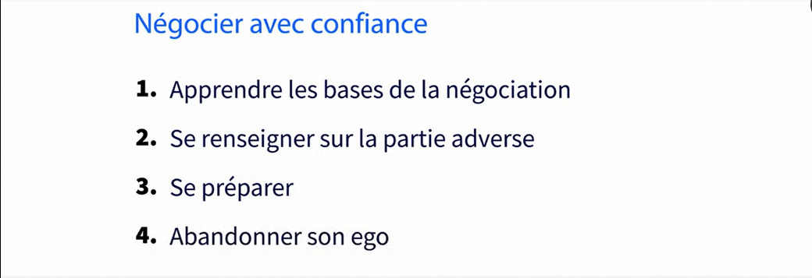

# art-de-negocier
Vous êtes amené à devoir négocier et vous ne savez pas comment aborder le processus de discussion ? L'incertitude et les comportements irrationnels risquent également de vous compliquer la tâche. Philippe Massol, consultant en techniques de vente, en stratégie et en communication d'influence, vous propose ce cours pour vous aider à préparer une négociation et à adopter les bonnes tactiques. Ensemble, vous verrez comment vous fixer un objectif, définir une stratégie, trouver la proposition à faire en ouverture, avancer dans l'échange et conduire efficacement une négociation.

## Prendre confiance en sa capacité à négocier

## Comprendre les motivations des deux parties
### Offre de depart

### Objectif de depart

### Enjeu

### Comment identifier l'objectif et l'enjeu du client
